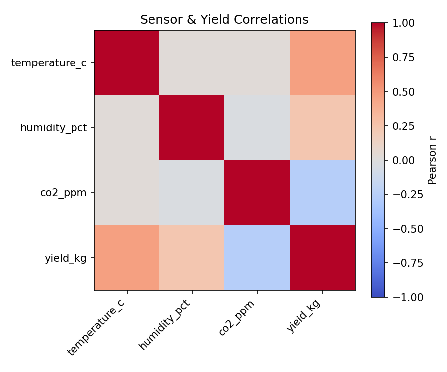
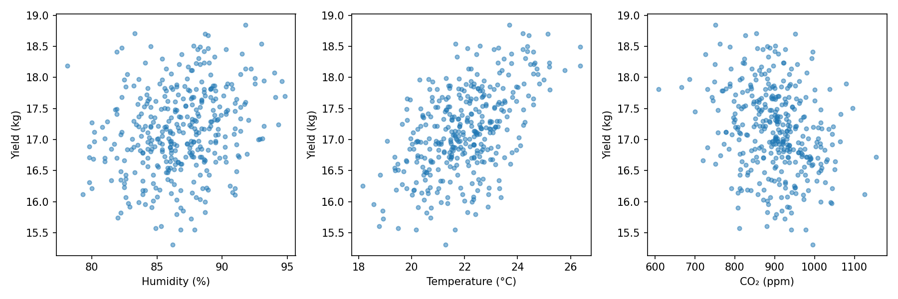
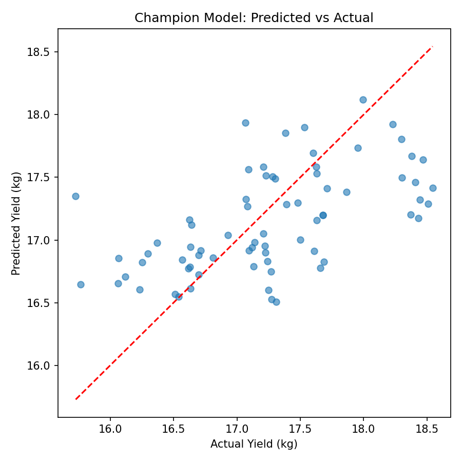
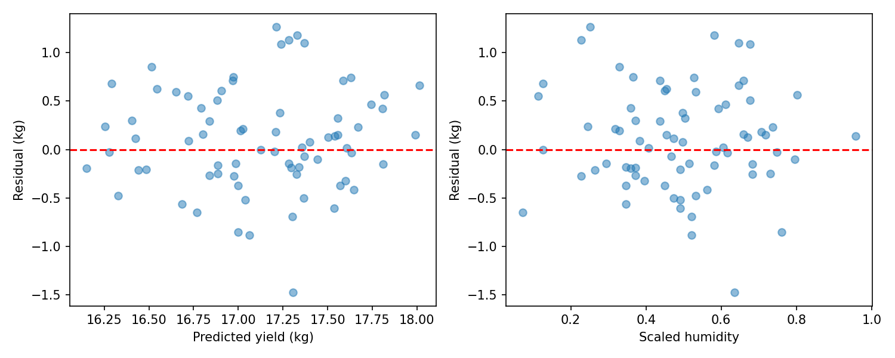
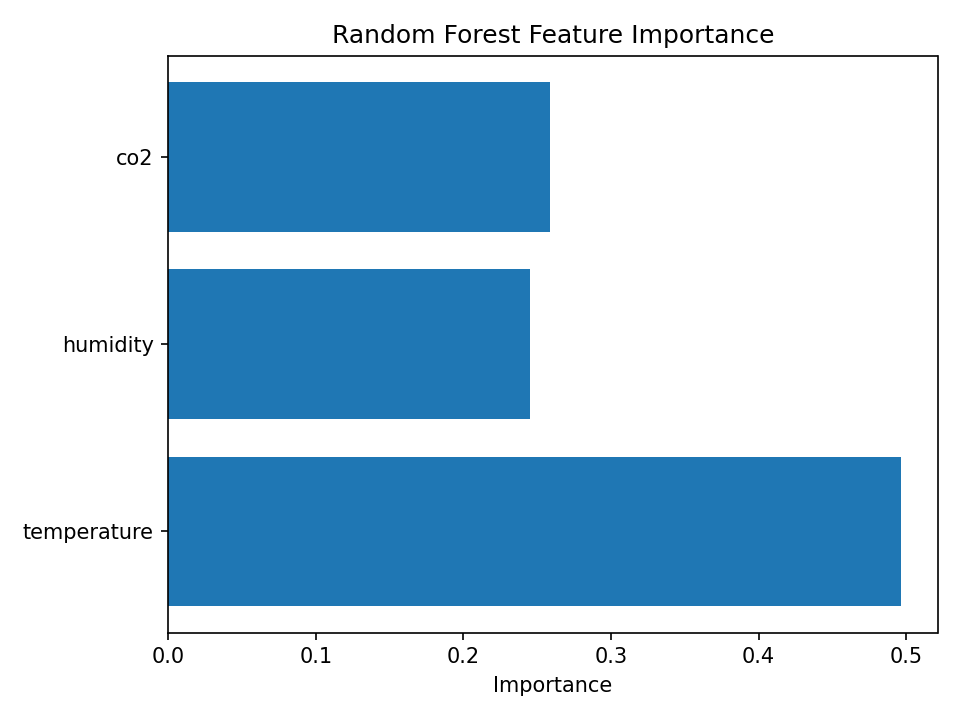

# Mushroom Yield Forecast – Final Technical Report

## Executive Summary

This project predicts oyster mushroom yield using environmental sensor data collected from a polyhouse. Machine learning models were trained using temperature, humidity, and CO₂ values. The Random Forest model was selected as the champion model after evaluation. A Streamlit web application was developed to provide real-time mushroom yield prediction.

---

# 1. Problem Statement

The aim of this project is to predict the daily mushroom yield using environmental sensor data from a polyhouse. This helps farmers monitor production and improve decision-making.

---

# 2. Dataset Description

## Input Features

* Temperature (°C)
* Humidity (%)
* CO₂ (ppm)

## Target Variable

* Mushroom Yield (kg)

---

# 3. Data Cleaning

The following preprocessing steps were performed:

* Removed missing values
* Checked duplicate records
* Validated sensor ranges
* Sorted records using timestamp
* Applied chronological train-test split
* Normalized data using MinMaxScaler

---

# 4. Exploratory Data Analysis

## Correlation Heatmap

The correlation heatmap shows the relationship between environmental features and mushroom yield.



### Observation

* Temperature has the strongest positive relationship with mushroom yield.
* Humidity also contributes positively.
* CO₂ has a weaker relationship with yield.

---

## Scatter Plot Analysis

The scatter plots show how environmental factors influence mushroom yield.



### Observation

* Yield increases with favorable temperature.
* Humidity supports mushroom growth.
* CO₂ has a moderate influence.

---

# 5. Model Development

The following machine learning models were developed:

* Linear Regression
* Random Forest Regression

Hyperparameter tuning was performed using GridSearchCV and TimeSeriesSplit cross-validation.

The Random Forest model was selected as the Champion Model.

---

# 6. Model Evaluation

## Predicted vs Actual

The following figure compares predicted yield with actual yield.



### Observation

The predicted values closely match the actual values, indicating good model performance.

---

## Residual Analysis

Residual analysis was performed to evaluate prediction errors.



### Observation

Residuals are randomly distributed around zero, indicating consistent model performance.

---
## Model Performance

The Random Forest model was selected as the Champion Model based on its evaluation results.

Performance Metrics

- Mean Absolute Error (MAE): **(your MAE value)**
- R² Score: **(your R² value)**

The Random Forest model achieved better performance than the Linear Regression model and was selected for deployment.

## Feature Importance

The Random Forest model identifies the importance of each feature.



### Observation

* Temperature is the most important feature.
* CO₂ is the second most important feature.
* Humidity also contributes to prediction.

---

# 7. Streamlit Application

A Streamlit application was developed for real-time mushroom yield prediction.

### Features

* Interactive sliders
* Predict Yield button
* Loading spinner
* Prediction result display
* Prediction logging

### Application Screenshot


---

# 8. Deployment

The application was deployed using Streamlit Community Cloud. The project repository was managed using Git and GitHub, and all required dependencies were included in the `requirements.txt` file.

---

# 9. Monitoring

Prediction logging was implemented to record:

* Timestamp
* Temperature
* Humidity
* CO₂
* Predicted Yield

The logs help monitor prediction performance and identify when model retraining is required.

---

# 10. Limitations

* Limited dataset size
* Only three environmental features were used
* External environmental factors were not included
* Model accuracy depends on sensor data quality

---

# 11. Future Work

* Collect more sensor data
* Improve model accuracy
* Add more environmental features
* Automate model retraining
* Develop an analytics dashboard

---

# Conclusion

The Mushroom Yield Forecast project successfully predicts oyster mushroom yield using machine learning and environmental sensor data. The Random Forest model achieved the best performance and was integrated into a Streamlit application for real-time prediction. This project demonstrates the practical application of machine learning in smart agriculture.

---

# Appendix

## Project Structure

```text
polyhouse_project/
├── data/
├── docs/
├── logs/
├── models/
├── reports/
│   ├── figures/
│   └── final_report.md
├── src/
├── tests/
├── requirements.txt
└── README.md
```

## Commands Used

```bash
pip install -r requirements.txt

pytest tests

streamlit run src/app.py

git add .

git commit -m "Final Project"

git push origin main
```